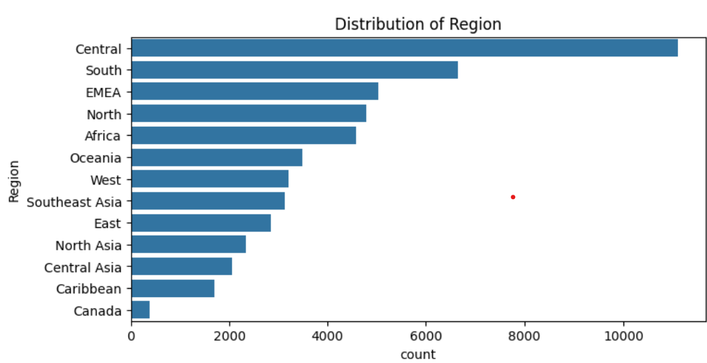
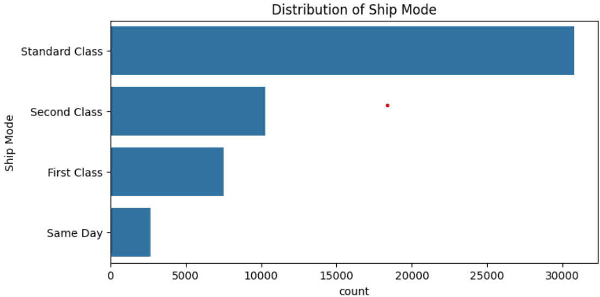
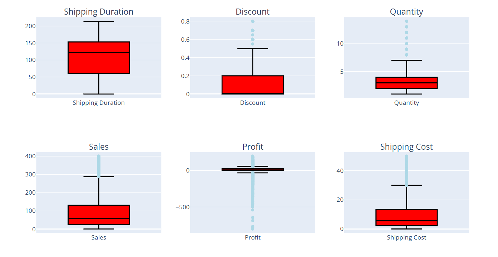
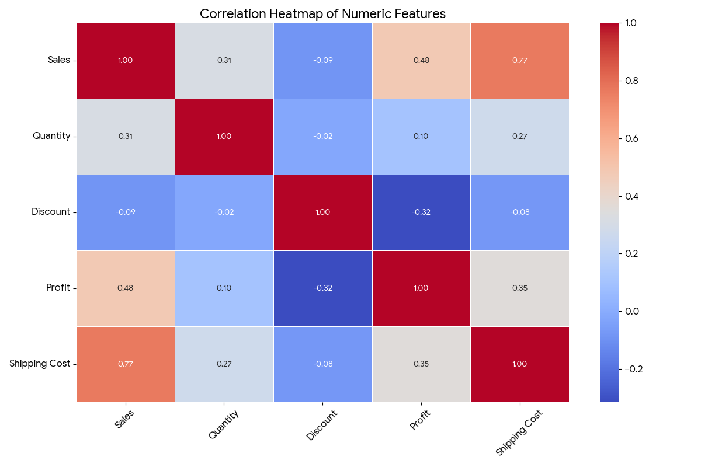
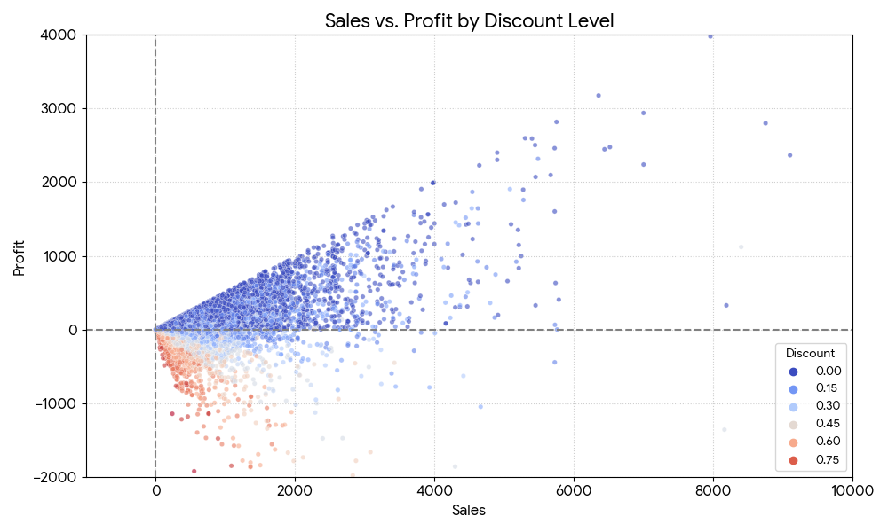
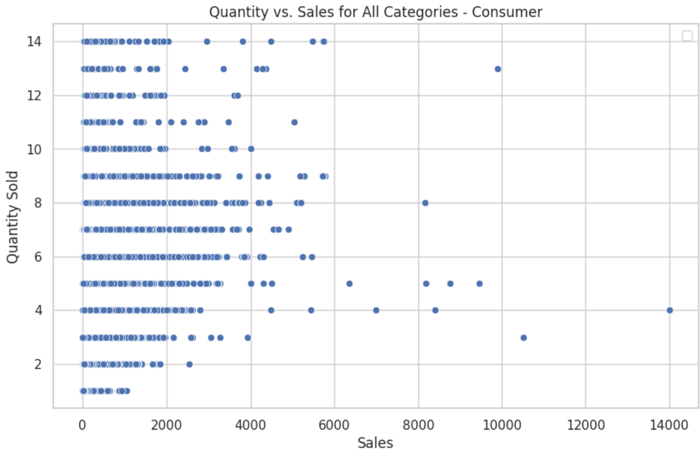
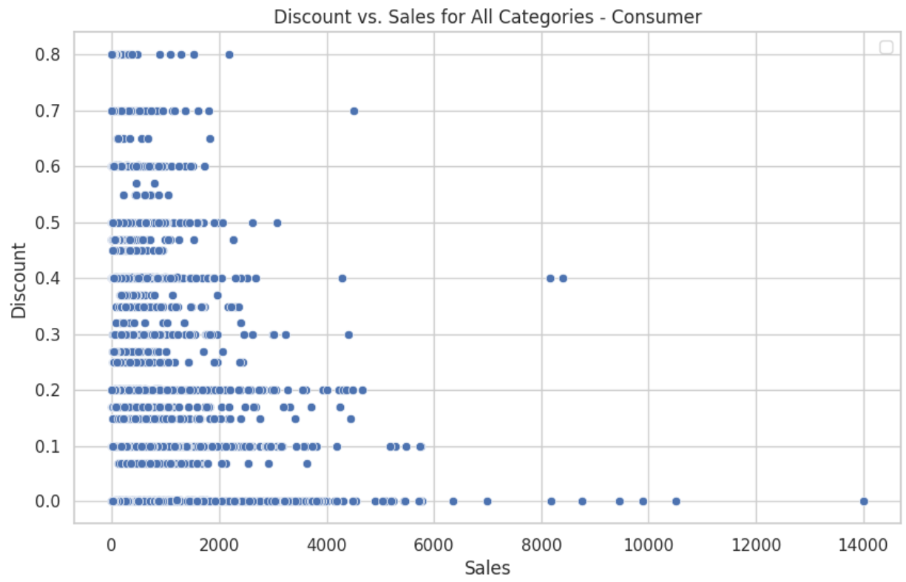
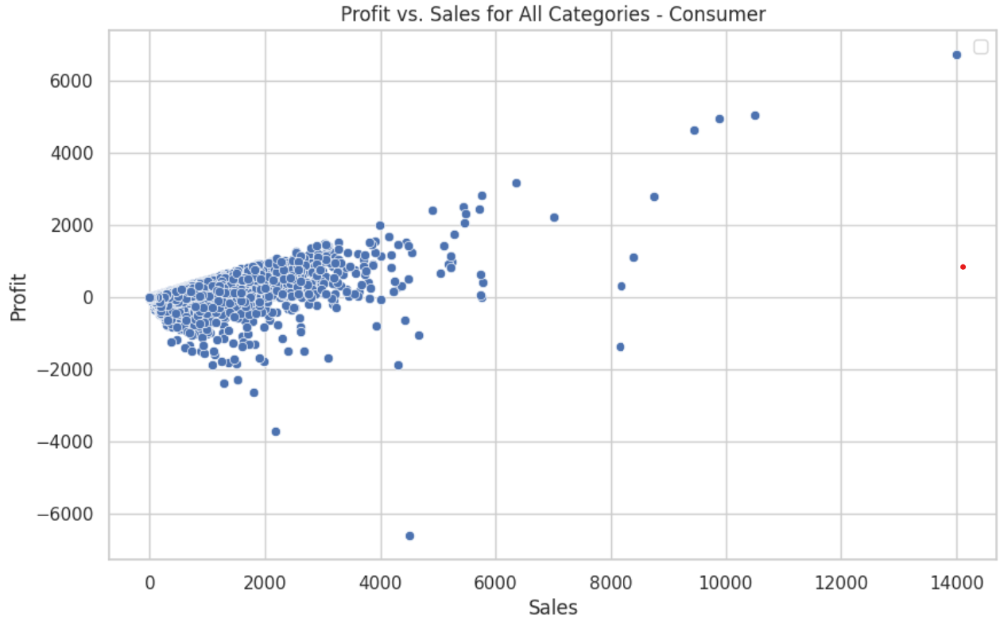
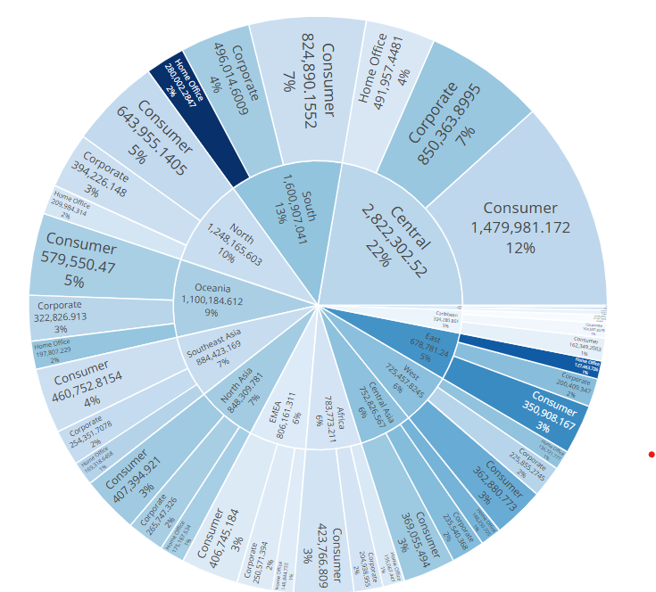

# Data-Driven Retail Optimization: Superstore Sales Prediction

<p align="left">
  
  
  
  
</p>

This repository contains the end-to-end machine learning project "Data-Driven Retail Optimization," completed as part of the Applied Machine Learning course (BUAN 6341). The project focuses on analyzing a large retail dataset to predict sales and uncover actionable business insights.

## 🎯 Project Overview & Business Problem

The retail industry is evolving rapidly, and businesses must leverage data to remain competitive. This project focuses on using data-driven approaches to enhance profitability and streamline operations for a large superstore.

The primary business motivations for this project were:
* **Business Insights:** Analyze sales data to uncover trends and customer behaviors that influence business strategies.
* **Profitability:** Understand the complex relationship between discounts, sales, and profits to optimize pricing and promotional strategies.
* **Operational Efficiency:** Streamline logistics and supply chain processes by analyzing shipping data.

The technical goal was to preprocess a complex dataset, perform deep exploratory data analysis, and implement several regression models to accurately predict `Sales`.

## 📊 Dataset

The dataset is a comprehensive "Superstore" dataset containing transaction-level data for a retail chain. It includes key features such as:
* `Order Date` & `Ship Date`
* `Ship Mode`
* `Segment` & `Category` / `Sub-Category`
* `Sales` (Target Variable)
* `Quantity`
* `Discount`
* `Profit`

## ⚙️ Methodology

The project followed a structured machine learning pipeline:

### 1. Data Preprocessing
* Cleaned the data by dropping rows with null values.
* Applied **Label Encoding** to transform object-type (categorical) features into a machine-readable format.
* Standardized all feature data to ensure models were not biased by features with different scales.

### 2. Exploratory Data Analysis (EDA)
A deep exploratory data analysis was conducted to understand distributions, relationships, and outliers. Here are the key findings from the analysis:

**Data Distributions (from Slide 5):**
Analysis of the key numeric features shows that `Sales`, `Profit`, and `Shipping Cost` are heavily right-skewed, indicating that most orders are low-value, with a long tail of high-value outliers.

<p align="center">
  
  
</p>
<p align="center">
  
  
</p>
<p align="center">
  
</p>


**Outlier Analysis (from Slide 8):**
Box plots confirmed the presence of significant outliers in `Sales` and `Shipping Cost`, which were flagged for careful handling during preprocessing, as they could disproportionately affect model performance.

<p align="center">
  
</p>


**Feature Relationships (Heatmap & Scatter Plots):**
A correlation heatmap was generated to understand relationships between numeric variables. It shows a predictable positive correlation between `Sales` and `Profit` and a negative correlation between `Profit` and `Discount`.

<p align="center">
  
</p>

The scatter plot below further investigates the `Sales` vs. `Profit` relationship, color-coded by `Discount`. It clearly visualizes that as the discount increases (orange/red dots), profit margins shrink and often become negative, even on high-sales items.

<p align="center">
  
</p>

*(Additional scatter plots from Slide 7)*
<p align="center">
  
  
  
  
</p>

**Category Analysis (from Slide 9):**
Hierarchical charts were used to visualize the relationship between categories, sub-categories, and profit. This helped identify `Tables` and `Bookcases` as major sources of negative profit, despite their sales volume.

<p align="center">
  
  
  
</p>

### 3. Feature Selection
A feature selection process was employed to identify and retain the most impactful features for predicting sales, reducing model complexity and improving performance.

### 4. Model Implementation & Tuning
* Split the data into training and test sets.
* Trained and evaluated four different regression models to compare performance:
    1.  **Ridge Regression (with Polynomial Features)**
    2.  **Random Forest Regressor**
    3.  **Gradient Boosting Regressor**
    4.  **XGBoost Regressor**
* Hyperparameter tuning was performed on the models to achieve optimal performance.

## 📈 Results & Key Findings

The models were evaluated based on their Root Mean Squared Error (RMSE) and R² (labeled as Accuracy % in the report) on the test set. The **XGBoost Regressor** was the definitive best-performing model.

<p align="center">
  
</p>

### Model Performance Summary

| Model | RMSE | R² (Accuracy) |
| :--- | :--- | :--- |
| Ridge Regression w/ Poly | 48.42 | 70.18% |
| Random Forest Regressor | 41.67 | 77.91% |
| Gradient Boosting Regressor | 38.82 | 80.83% |
| **XGBoost Regressor** | **38.44** | **81.20%** |
*(Data sourced from project presentation)*

**Key Finding:** The **XGBoost Regressor** provided the highest accuracy (81.20%) and the lowest error (RMSE: 38.44), making it the most reliable model for predicting sales. The Random Forest model, while strong, showed signs of overfitting compared to the boosting models.

## 🛠️ Tools & Technologies Used

* **Python:** Core programming language for analysis and modeling.
* **Pandas:** For data manipulation, cleaning, and preprocessing.
* **Matplotlib & Seaborn:** For exploratory data analysis and visualization.
* **Scikit-learn (sklearn):** For data splitting, standardization, and implementing Ridge, Random Forest, and Gradient Boosting models.
* **XGBoost:** For implementing the best-performing XGBoost Regressor model.
* **Jupyter Notebook:** For interactive code development and analysis.

## 🚀 How to Run This Project

1.  Clone this repository to your local machine:
    ```sh
    git clone [https://github.com/YOUR_USERNAME/YOUR_REPO_NAME.git](https://github.com/YOUR_USERNAME/YOUR_REPO_NAME.git)
    ```
2.  Navigate to the project directory:
    ```sh
    cd YOUR_REPO_NAME
    ```
3.  Install the required dependencies (you can create a `requirements.txt` file for this):
    ```sh
    pip install pandas numpy matplotlib seaborn scikit-learn xgboost jupyter
    ```
4.  Open the Jupyter Notebook to view and run the analysis:
    ```sh
    jupyter notebook "Superstore Sales Prediction using Machine Learning.ipynb"
    ```
