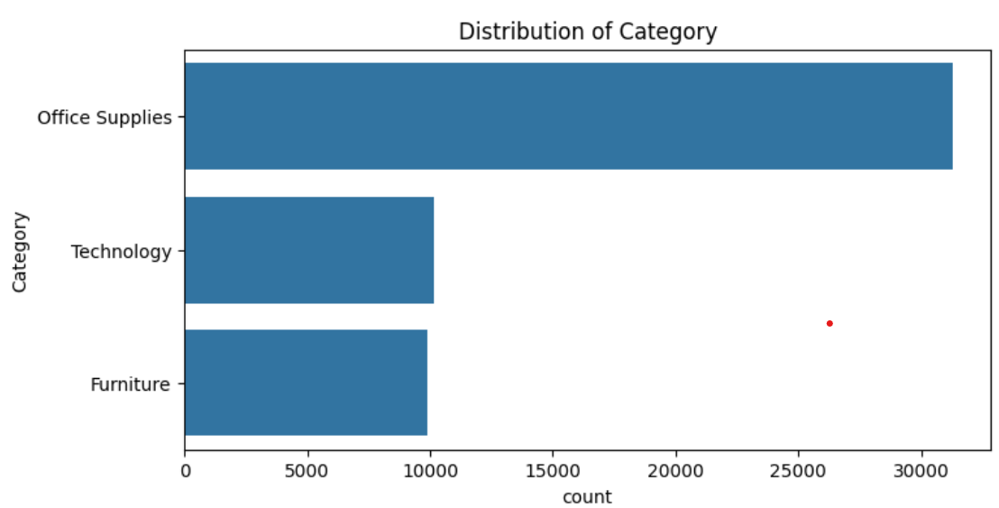
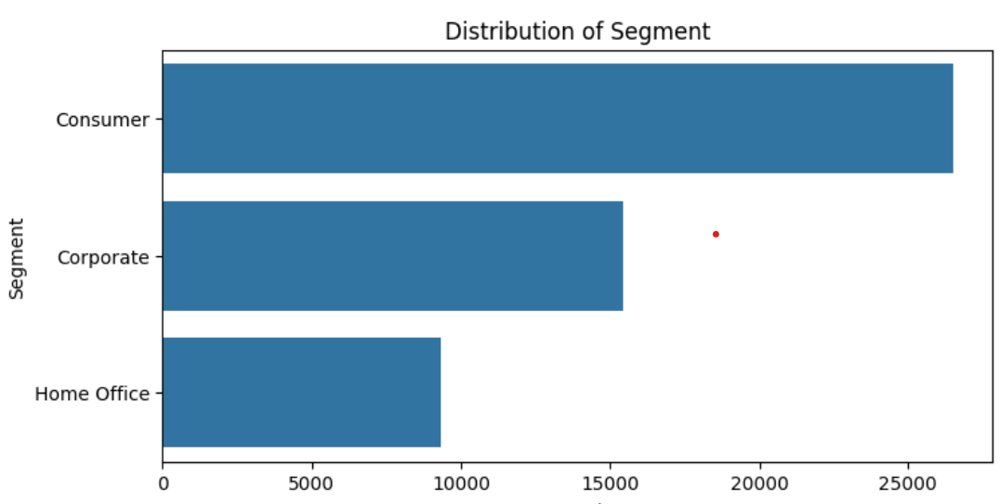
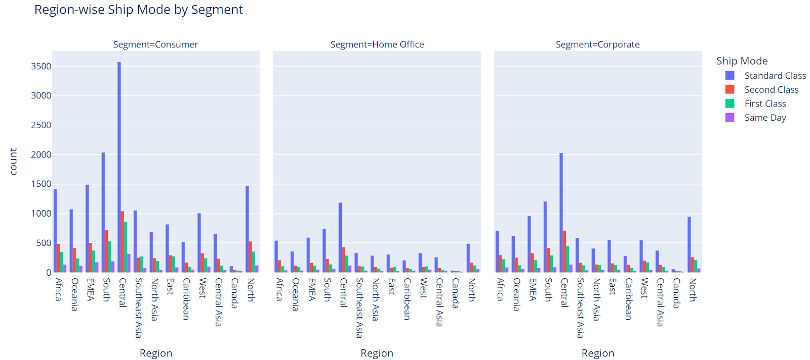
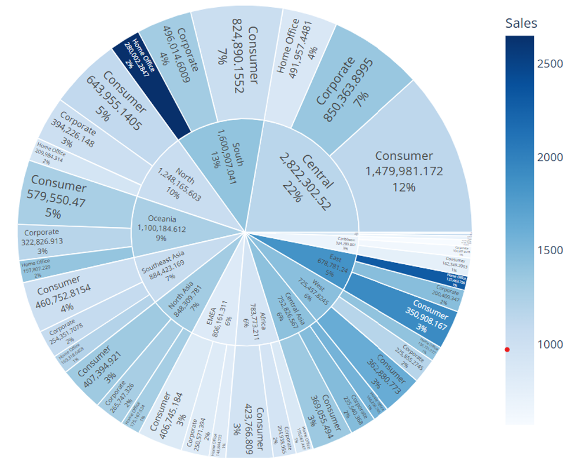
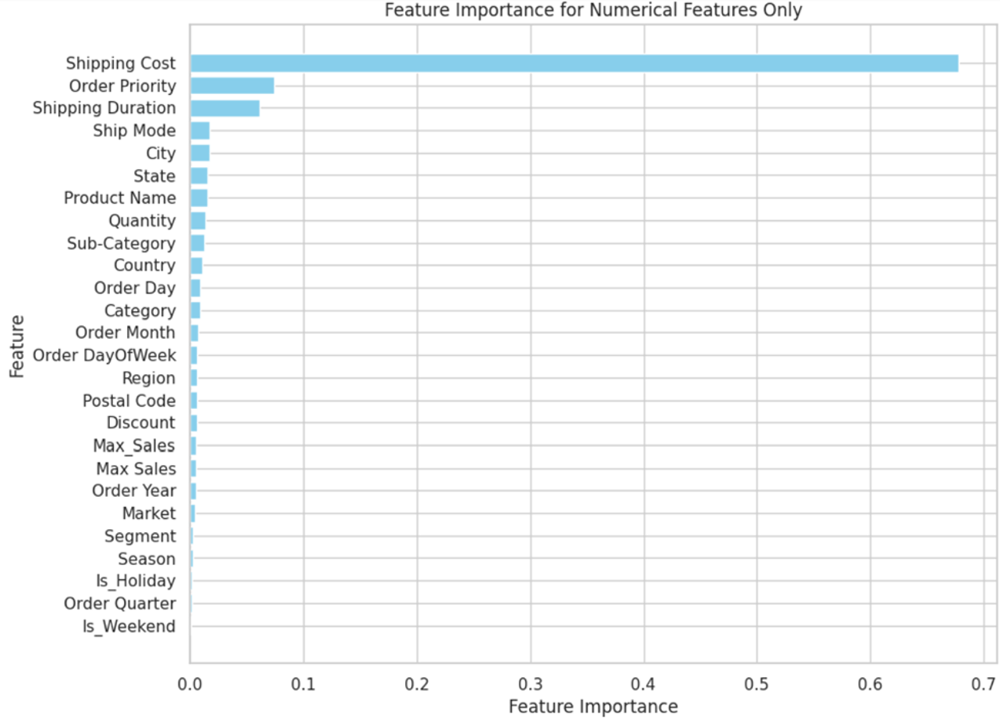
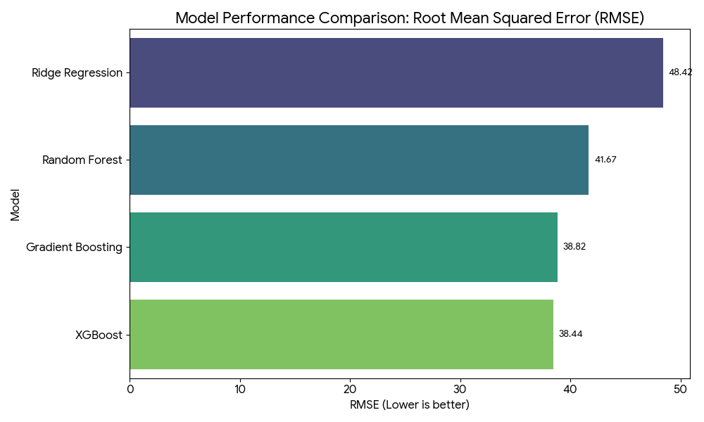

# Data-Driven Retail Optimization: Superstore Sales Prediction

<p align="left">
  
  
  
  
</p>

This repository contains an end-to-end machine learning project on "Data-Driven Retail Optimization." The project focuses on analyzing a large retail dataset to predict sales and uncover actionable business insights.

## 🎯 Project Overview & Business Problem

The retail industry is evolving rapidly, and businesses must leverage data to remain competitive. This project focuses on using data-driven approaches to enhance profitability and streamline operations for a large superstore.

The primary business motivations for this project were:
* **Business Insights:** Analyze sales data to uncover trends and customer behaviors that influence business strategies.
* **Profitability:** Understand the complex relationship between discounts, sales, and profits to optimize pricing and promotional strategies.
* **Operational Efficiency:** Streamline logistics and supply chain processes by analyzing shipping data.

The technical goal was to preprocess a complex dataset, perform deep exploratory data analysis, and implement several regression models to accurately predict `Sales`.

## 📊 Dataset

The dataset is a comprehensive "Superstore" dataset containing transaction-level data for a retail chain. It includes key features such as:
* `Order Date` & `Ship Date`
* `Ship Mode`
* `Segment` & `Category` / `Sub-Category`
* `Sales` (Target Variable)
* `Quantity`
* `Discount`
* `Profit`

## ⚙️ Methodology

The project followed a structured machine learning pipeline:

### 1. Data Preprocessing
A thorough preprocessing phase was conducted to prepare the data for modeling.
* **Data Cleaning:** Cleaned the data by dropping rows with NaT (Not a Time) values in date columns.
* **Feature Engineering:** Removed non-essential features like `Order Date` and `Ship Date` that were not used in the final model.
* **Encoding:** Applied **Label Encoding** to transform all object-type (categorical) features (like `Category`, `Sub-Category`, `Segment`, etc.) into a machine-readable numerical format.
* **Data Splitting:** Defined the feature matrix (X) and the target variable (y - `Sales`) and split the data into training and test sets for model evaluation.
* **Standardization:** Standardized all feature data using `StandardScaler` to ensure all features have a mean of 0 and a standard deviation of 1. This prevents models from being biased by features with different scales.

### 2. Exploratory Data Analysis (EDA)
A deep exploratory data analysis was conducted to understand distributions, relationships, and outliers. Here are the key findings from the analysis:

**Data Distributions:**
A review of the core data distributions revealed critical insights. The histograms for `Sales` and `Shipping Cost` are heavily **right-skewed**, indicating that the vast majority of orders are small, low-value transactions, with a few significant, high-value outliers. This skewness is a key finding for preprocessing, as models can be disproportionately affected by these extreme values.

<p align="center">
  
  
</p>
<p align="center">
  
  
</p>
  The histograms for segement wise ditribution across regions.

<p align="center">
  
</p>


**Outlier Analysis:**
The box plot provides a clear visual confirmation of the distribution skewness found in the histograms. It shows a large number of data points for `Sales` and `Shipping Cost` existing far beyond the standard range (the "whiskers"). This diagnostic plot reinforces the need for robust data scaling or transformations to build a reliable model.

<p align="center">
  
</p>


**Feature Relationships (Heatmap & Scatter Plots):**
To understand the drivers of profit, a correlation heatmap was generated. It reveals the first major business insight: a predictable positive link between `Sales` and `Profit`, but a strong **negative correlation between `Profit` and `Discount`**.

<p align="center">
  
</p>

This negative correlation is the most important finding. The scatter plot below provides the visual proof, investigating the `Sales` vs. `Profit` relationship, color-coded by `Discount`. It clearly visualizes that as the `Discount` increases (orange/red dots), `Profit` trends down, often plunging into negative territory (below the 0-line). This insight pinpoints a critical flaw in the store's promotional strategy: **discounts are actively driving unprofitability** on many transactions.

<p align="center">
  
</p>

*(Additional scatter plots showing various feature relationships)*
<p align="center">
  
  
  
  
</p>

**Category Analysis:**
The sunburst chart was used to drill down into *where* the unprofitability is coming from. By visualizing profit by category and sub-category, it becomes clear that specific product lines, such as **'Tables' and 'Bookcases', are major sources of negative profit**, even when they have high sales volume. This provides a surgical, actionable insight rather than just a general warning.

<p align="visible">
  
</p>

### 3. Feature Selection
A feature selection process was employed to identify and retain the most impactful features for predicting sales, reducing model complexity and improving performance.
* A **Random Forest Regressor** was used to calculate feature importance scores. This model assesses each feature's contribution to prediction accuracy.
* Features with low importance scores were considered for removal to reduce model complexity.
* The analysis identified the top features for predicting sales, including **'Profit', 'Discount', 'Shipping Cost', 'Category',** and **'Segment'**.
<p align="center">
  
</p>

### 4. Model Implementation & Tuning
Four different regression models were trained and evaluated to compare performance and identify the most suitable algorithm:
* **Ridge Regression (with Polynomial Features):** Chosen for its ability to handle potential multicollinearity between features.
* **Random Forest Regressor:** A powerful ensemble model known for handling complex non-linear relationships and feature interactions effectively.
* **Gradient Boosting Regressor:** An ensemble method that builds trees sequentially, with each new tree correcting the errors of the previous one, often leading to high accuracy.
* **XGBoost Regressor:** A high-performance, optimized version of Gradient Boosting, known for its speed and predictive power, often a top choice in machine learning competitions.
* Hyperparameter tuning was performed on the models to achieve optimal performance.

## 📈 Results & Key Findings

The final models were evaluated based on their Root Mean Squared Error (RMSE) and R² on the test set. The bar chart provides a clear visual summary of the results, comparing the error rates of all tested models and providing the "proof" of the work.

<p align="center">
  
</p>

### Model Performance Summary

| Model | RMSE | R² (Accuracy) |
| :--- | :--- | :--- |
| Ridge Regression w/ Poly | 48.42 | 70.18% |
| Random Forest Regressor | 41.67 | 77.91% |
| Gradient Boosting Regressor | 38.82 | 80.83% |
| **XGBoost Regressor** | **38.44** | **81.20%** |
*(Data sourced from project presentation)*

**Key Finding:** The **XGBoost Regressor** was the definitive winner, providing the highest accuracy (81.20%) and the lowest error (RMSE: 38.44). This justifies the final model choice and demonstrates a methodical, comparative approach to model selection. The Random Forest model, while strong, showed signs of overfitting (significantly lower training error than test error) compared to the more robust boosting models.

## 🏁 Conclusion
The analysis concludes that the **XGBoost Regressor (RMSE: 38.44, R²: 81.20%)** is the most accurate and suitable model for predicting sales for this dataset.

Furthermore, the EDA provided critical business insights, most notably that the company's discount strategy is a major source of unprofitability, especially in the **'Tables'** and **'Bookcases'** sub-categories. A key business recommendation is to strategically re-evaluate and adjust discount policies for these specific unprofitable product lines to improve overall profitability.

## 🛠️ Tools & Technologies Used

* **Python:** Core programming language for analysis and modeling.
* **Pandas:** For data manipulation, cleaning, and preprocessing.
* **Matplotlib & Seaborn:** For exploratory data analysis and visualization.
* **Scikit-learn (sklearn):** For data splitting, standardization, and implementing Ridge, Random Forest, and Gradient Boosting models.
* **XGBoost:** For implementing the best-performing XGBoost Regressor model.
* **Jupyter Notebook:** For interactive code development and analysis.

## 🚀 How to Run This Project

1.  Clone this repository to your local machine:
    ```sh
    git clone [https://github.com/AmitKPandeyLabs/ML_P1_Data_Driven_Retail_Optimization.git](https://github.com/AmitKPandeyLabs/ML_P1_Data_Driven_Retail_Optimization.git)
    ```
2.  Navigate to the project directory:
    ```sh
    cd ML_P1_Data_Driven_Retail_Optimization
    ```
3.  Install the required dependencies (you can create a `requirements.txt` file for this):
    ```sh
    pip install pandas numpy matplotlib seaborn scikit-learn xgboost jupyter
    ```
4.  Open the Jupyter Notebook to view and run the analysis:
    ```sh
    jupyter notebook "Superstore Sales Prediction using Machine Learning.ipynb"
    ```
